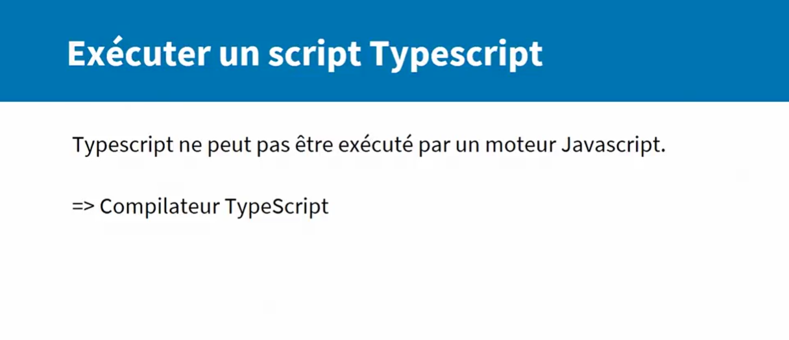
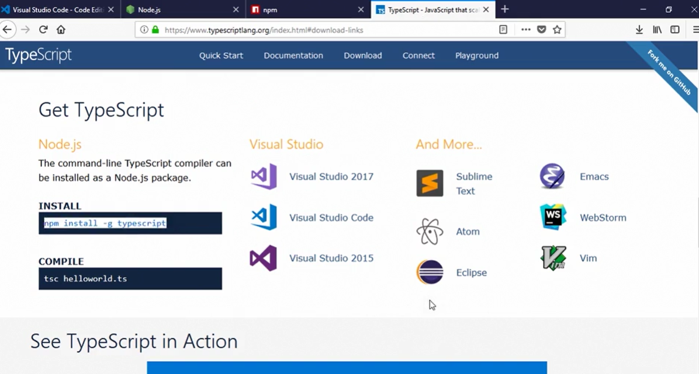
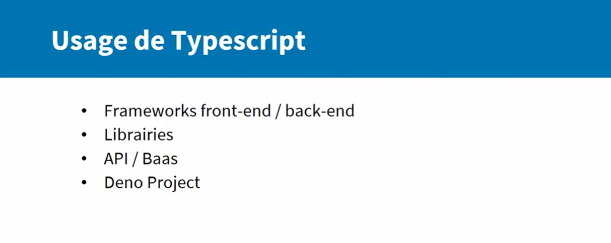
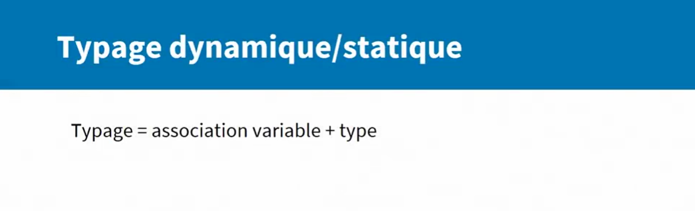
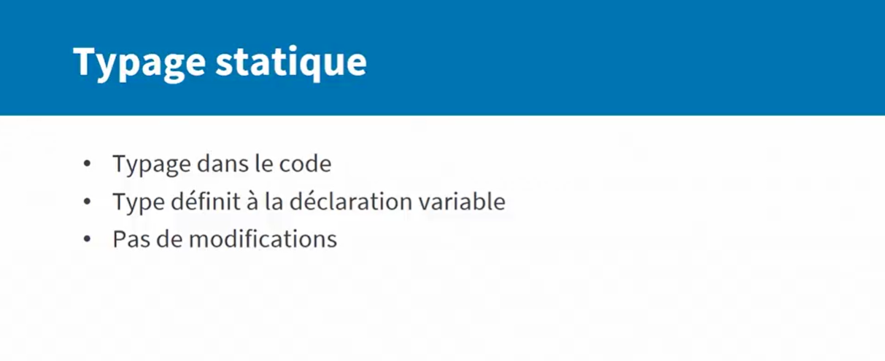
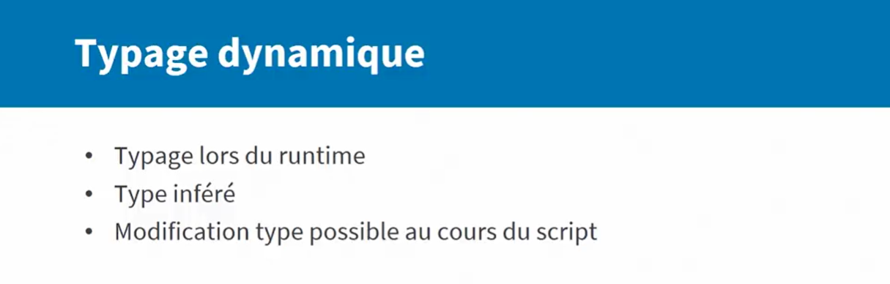
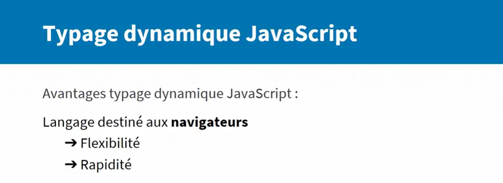
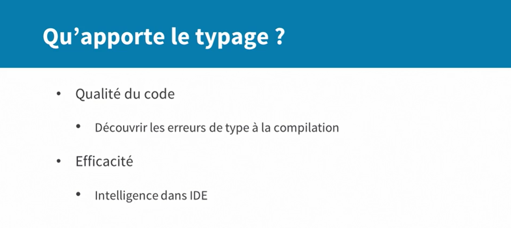

# L'essentiel de TypeScript 2
Vous souhaitez améliorer la maîtrise de vos développements JavaScript ? Vous souhaitez en savoir plus sur TypeScript et migrer vers ce langage ? Ce cours est fait pour vous. Elise Patrikainen vous donne les outils indispensables pour réussir vos développements d'applications TypeScript, de A à Z. Étape par étape, vous allez voir comment exploiter le typage statique, maîtriser les étapes de build et de compilation, utiliser des fonctionnalités JavaScript déjà intégrées et structurer votre projet. Ainsi, vous obtiendrez le résultat souhaité, conforme aux standards des librairies et des applications TypeScript.

## définition

## Pourquoi TypeScript

## Exécution du JavaScript

## Exécution du TypeScript

## Installation du compilateur TypeScript

## Usage de TypeScript

## Typage Statique

## Typage Dynamique

## Avantage du typage dynamique en Javascript

## Avantage du typage static en Javascript
