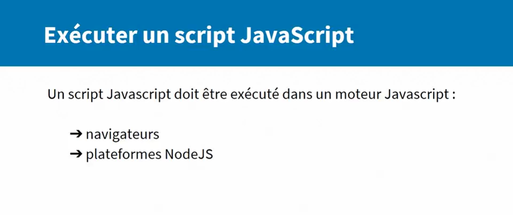
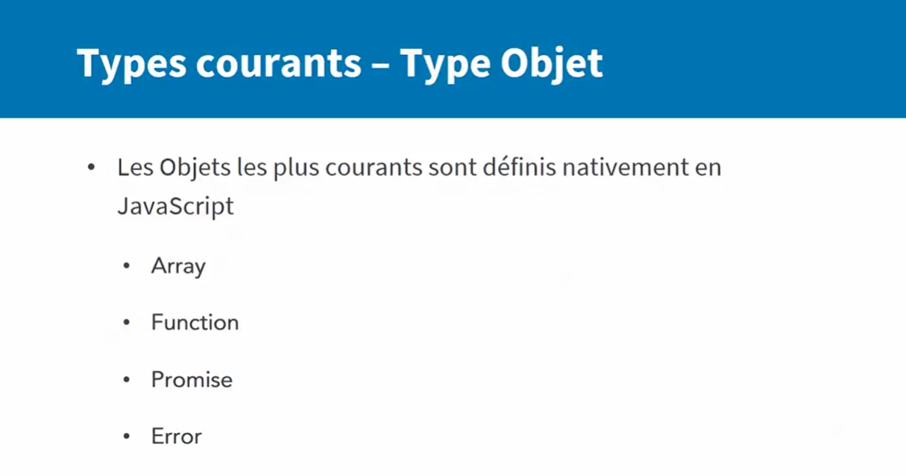

# L'essentiel de TypeScript 2
Vous souhaitez améliorer la maîtrise de vos développements JavaScript ? Vous souhaitez en savoir plus sur TypeScript et migrer vers ce langage ? Ce cours est fait pour vous. Elise Patrikainen vous donne les outils indispensables pour réussir vos développements d'applications TypeScript, de A à Z. Étape par étape, vous allez voir comment exploiter le typage statique, maîtriser les étapes de build et de compilation, utiliser des fonctionnalités JavaScript déjà intégrées et structurer votre projet. Ainsi, vous obtiendrez le résultat souhaité, conforme aux standards des librairies et des applications TypeScript.

## définition

## Pourquoi TypeScript

## Exécution du JavaScript

## Exécution du TypeScript

## Installation du compilateur TypeScript

## Usage de TypeScript

## Typage Statique

## Typage Dynamique

## Avantage du typage dynamique en Javascript

## Avantage du typage static en Javascript

## Types Courant en JavaScript
### Types Courants Primitifs

### Types Courants Objets

## Créer des types en TypeScript

### Les Interfaces

### Les classes 

### Différence entre classe et interface

## Gulp 
Gulp permet d'automatiser les projets javascripts

### Structure d'un projet Gulp

## Initialisation du projet Gulp

### Typescript et gulp-typescript

### Configuration de gulp
pour configurer gulp, je vous redirige vers ce repo [configuration de gulb](https://github.com/ivogabe/gulp-typescript#basic-usage) et vous copiez la première section vous l'adaptez comme suit:
<code>
    <pre>
        var gulp = require('gulp');
        var ts = require('gulp-typescript');

        gulp.task('default', function () {
            return gulp.src('src/main.ts')
                .pipe(ts({
                    noImplicitAny: true,
                    outFile: 'main.js'
                }))
                .pipe(gulp.dest('dist'));
        });
</pre>
</code>

## Pour Créer un bundle 
On doit dabord créer un fichier **html** générelement nommé **index.hml** qui contiendra **bundle.js**
et ensuite, on aura besoin de ces trois dependances 
<code>npm install --save-dev browserify tsify vinyl-source-stream</code>